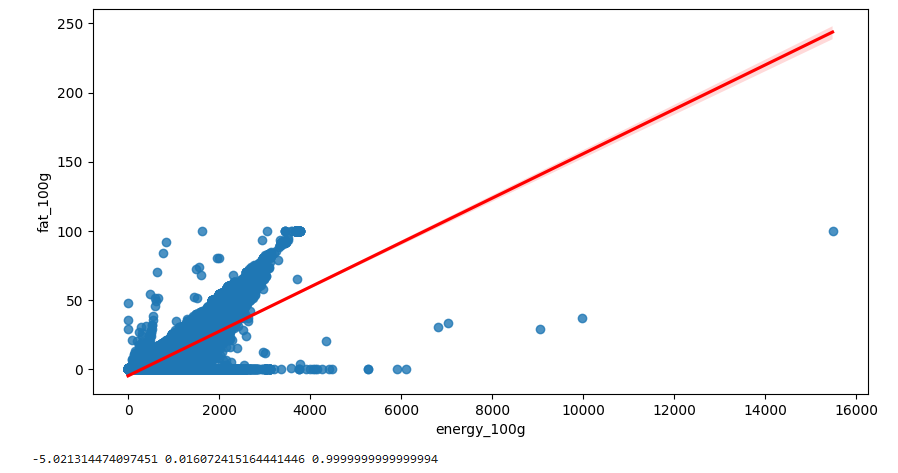
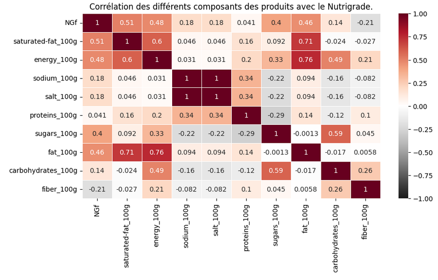
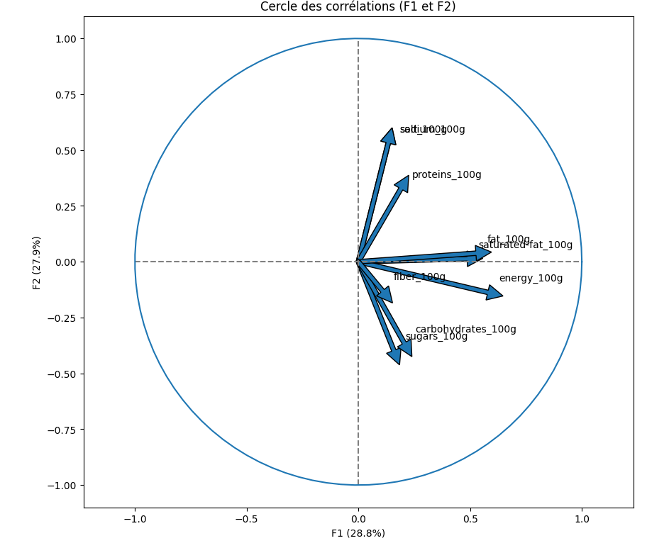
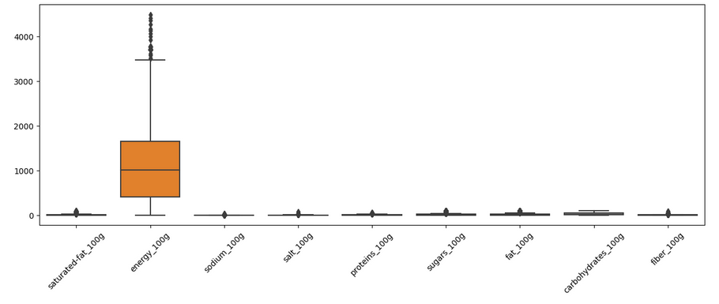
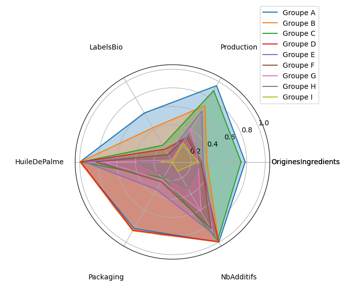

# Projet_Perso_Conception_Application_Santé_Publique

## **📌 Contexte et Objectif**

**Entreprise** : Santé Publique France  
**Logo** : 

### **🎯 Objectif**  
L'objectif de ce projet est de **concevoir une application innovante** liée à l'alimentation en exploitant des données provenant de la base Open Food Facts. L'application a pour but de fournir des informations pratiques aux consommateurs, telles que le Nutri-Score et un nouveau score environnemental basé sur la composition des produits.

### **📂 Jeux de données**  
- **Site officiel :** [Open Food Facts](https://world.openfoodfacts.org/)  
- **Téléchargement direct du dataset :** [Télécharger](https://s3-eu-west-1.amazonaws.com/static.oc-static.com/prod/courses/files/Parcours_data_scientist/Projet+-+Donn%C3%A9es+%C3%A9ducatives/Projet+Python_Dataset_Edstats_csv.zip)  
- **Description des variables :** [Site officiel des données](https://world.openfoodfacts.org/data/data-fields.txt)

Les données comprennent :
- **Informations générales** : nom du produit, date de modification, etc.
- **Tags** : catégorie du produit, localisation, origine, etc.
- **Ingrédients** : liste des ingrédients et additifs.
- **Informations nutritionnelles** : quantités des nutriments pour 100g de produit.

---

## **🚀 Réalisations et Méthodologie**

### **1️⃣ Chargement et exploration des données**
- **Ouverture des fichiers** et examen des informations générales.
- **Analyse des données** : Identification des valeurs manquantes (NaNs) à l'aide de `missingno`.
  
### **2️⃣ Préparation des données**
- Sélection des variables pertinentes en fonction de l'objectif du projet (pays, type de nutriment ou d'additifs).
- **Analyse de la corrélation entre les variables** :
  
  
  

- **Traitement des outliers** : Identification et suppression des valeurs aberrantes.
  

### **3️⃣ Modélisation et prédiction**
- **Idée d'application :** Ajout d'un "EnvironnementScore" à côté du Nutri-Score pour évaluer l'impact environnemental des produits alimentaires.
- **Modèles de Machine Learning utilisés** pour prédire le **Nutrition Grade** :
  - KNN (K-Nearest Neighbors)
  - KMeans (Clustering)
  - Decision Tree (Arbre de Décision)
  - Logistic Regression (Régression Logistique)

### **4️⃣ Visualisation et analyse des résultats**
- Divers graphiques pour illustrer les résultats :
  

- **Analyse du score Environnemental (EnvironementScore) en KMeans** :
  - Analyse statistique des groupes avec le test de **Tukey**.
  - **Radar chart** pour visualiser la distribution des différents groupes.

  

---

## **📈 Résultats et Insights**

- **Analyse des données** : Les produits avec un Nutri-Score plus élevé sont souvent moins bons pour l'environnement.
- L'intégration d'un score environnemental permet de sensibiliser les consommateurs à l'impact des produits alimentaires sur la planète.

---

## **🛠️ Technologies et Outils Utilisés**

- **Langage :** Python 🐍
- **Librairies :** Pandas, Numpy, Seaborn, Matplotlib, tqdm, Scipy, sklearn
- **Environnement :** Jupyter Notebook
- **Méthodes utilisées :** Data cleaning, Data visualization, Machine Learning, KMeans Clustering

---

## **📬 Contact et Feedback**

💡 Ce projet a été réalisé dans le cadre de ma formation en **Data Science**. N'hésitez pas à me faire part de vos suggestions ou questions !

📩 **Contact :**  
📧 [johan.rocheteau@hotmail.fr](mailto:johan.rocheteau@hotmail.fr)  
🔗 [LinkedIn](https://www.linkedin.com/in/johan-rocheteau)

    

